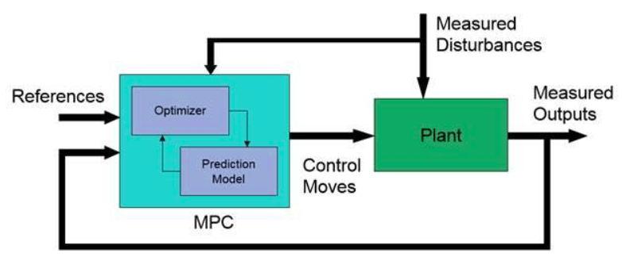
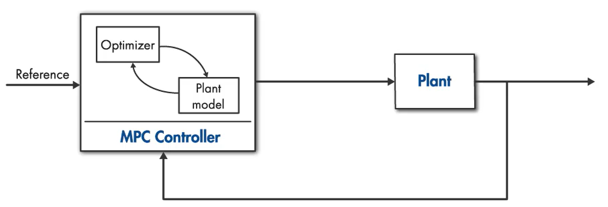
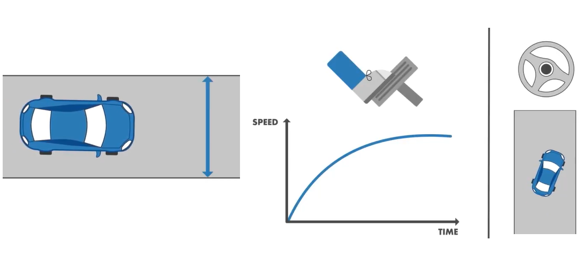
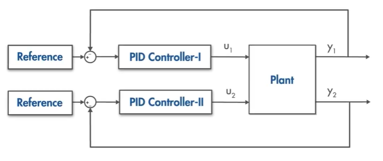
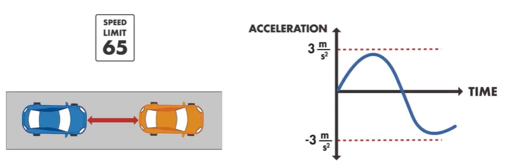
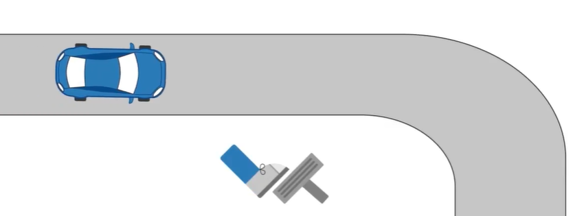
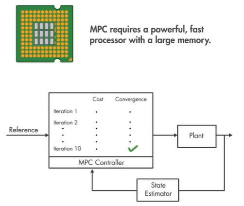
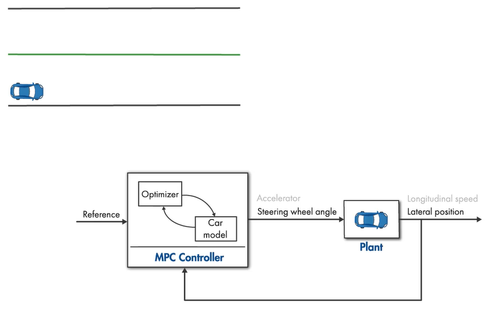
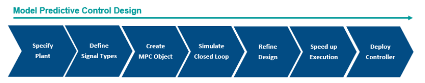

# MPC

Técnica que determina a ação de controle pela minimização de 
uma função objetivo a partir da predição de cenários finitos de simulação de um sistema dinâmico.

- Sistemas lineares e não lineares;
- Sistemas multivariáveis (MIMO);

  

---

# MPC - Malha de controle

  

---

# MPC - Conceitos

- MPC;
- Otimização;
- Horizonte de predição;
- Função custo;
- Restrições;
- Receding horizon;

---

# MPC

  

---

# MPC

  

  

---

# MPC - Sistemas multivariáveis

  

  

---

# MPC - Restrições e antecipação

  

  

---

# MPC - Processamento e Memória

  

---
class: center,  middle, inverse

# MPC: Como funciona?

---

# MPC

  

---

# MPC - Predição

  

---

# MPC - Várias Predições

  

---

# MPC - Otimização - Função custo

  

---

# MPC - Avaliando o custo

  

---

# MPC - Ação de controle

  

---

# MPC - Horizonte de eventos

  

---

# Projeto de MPC

  

Planta linear, restrições lineares, função custo quadrática:

1. Definição do modelo do sistema;
2. Definir sinais de entrada e saída;
3. Criar objeto MPC;
4. Simular malha fechada;
5. Refinar o projeto;
6. Acelerar execução;
7. Implantar controlador;

---

# Pacotes MPC - python

- [OSQP](https://osqp.org/) 
- [GEKKO](https://machinelearning.byu.edu/)

---

class: title-slide-final, middle

