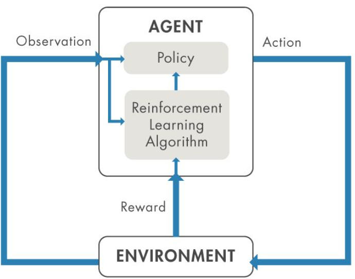

# Aprendizagem por reforço:

  

---

# Variáveis de interesse

- Ação $u(t)$ - Todos os movimentos possíveis que o agente pode executar;
- Estado $x(t)$ - Variáveis que representam a condição do sistema;
- Recompensa $r(t)$ - Retorno imediato para avaliar a última ação;
- Política $\pi()$ - Estratégia que o agente emprega para definir a próxima ação;
- Valor $V(x)$ - Retorno esperado a longo prazo, com desconto, em oposição à recompensa de curto prazo;
- Valor $Q(x,u)$ - Semelhante a $V$ considerando $u$;

---
class: title-slide-final, middle

---