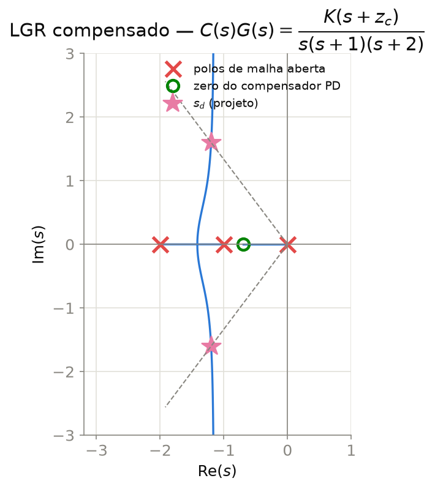
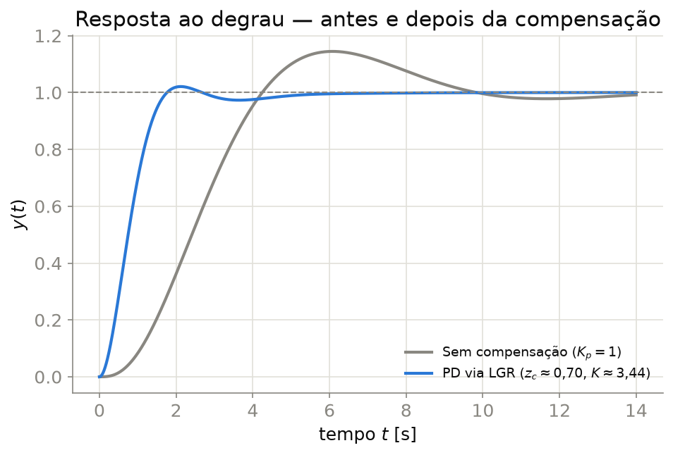

## Contexto

O Lugar Geométrico das Raízes (LGR) mostra como os polos de malha fechada se deslocam no plano $s$ à medida que um ganho $K$ varia — mas o LGR de uma planta não compensada nem sempre passa pela região do plano $s$ que atende às especificações de projeto (sobressinal $M_p$, tempo de acomodação $t_s$). A sintonia de um PID via LGR consiste em adicionar polos e zeros ao compensador especificamente para *remodelar* o lugar geométrico, forçando-o a passar pelo ponto de polo dominante desejado.

Esta nota cobre o caso PD (ação proporcional-derivativa) por compensação de avanço de fase via LGR — o caso mais direto de visualizar — e comenta como estender para PID completo adicionando um polo na origem (ação integral) sem alterar significativamente o lugar já projetado.

Pré-requisito: condição de ângulo e módulo do LGR (ver `ControleClassico/Notas/Aula07LGR.qmd`); PID e seus efeitos (ver `Aula09PID.qmd`).

## Formulação Matemática

- **Condição de ângulo:** $\angle G(s)H(s) = 180°(2k+1)$ — um ponto $s_d$ só pertence ao LGR se satisfizer essa condição.
- **Déficit de ângulo** no ponto de projeto desejado $s_d = -\zeta\omega_n + j\omega_n\sqrt{1-\zeta^2}$: soma dos ângulos dos polos/zeros da planta em $s_d$, comparada a $180°$.
- **Posição do zero do compensador PD**, $C(s) = K(s+z_c)$: escolhida para que o ângulo do zero cubra exatamente o déficit.
- **Condição de módulo** para obter $K$: $K = \dfrac{1}{|G(s_d)(s_d+z_c)|}$.

## Projeto do Compensador — Exemplo

Planta de exemplo (mesma já usada em `Aula09PID.qmd`, para consistência):

$$G(s) = \frac{1}{s(s+1)(s+2)}$$

Especificação alvo: $\zeta = 0{,}6$, $\omega_n = 2$ rad/s $\Rightarrow s_d = -1{,}2 + j1{,}6$.

**Passo 1 — ângulos dos polos em $s_d$:** os polos em $0$, $-1$ e $-2$ contribuem, respectivamente, $120°$, $90°$ e $60°$ — soma de $270°$.

**Passo 2 — déficit de ângulo:** o zero do compensador precisa contribuir $\angle(s_d+z_c) = 180° + 270° \pmod{360°} = 90°$ (normalizado) para fechar a condição de ângulo em $-180°$.

**Passo 3 — posição do zero:** resolvendo $\angle(s_d+z_c)=90°$ para $z_c$ real, obtém-se $z_c \approx 0{,}698$.

**Passo 4 — ganho pela condição de módulo:** $K \approx 3{,}44$.

**Verificação:** com $C(s) = 3{,}44\,(s+0{,}698)$, a malha fechada tem polos em exatamente $-1{,}2\pm j1{,}6$ (o par projetado) mais um terceiro polo real em $-0{,}6$ — próximo o bastante do zero do compensador para não dominar a resposta. Note que **não** escolhemos $\zeta=0{,}5,\ \omega_n=2$ (primeira tentativa): esse alvo colocaria o zero exatamente em $s=-1$, cancelando trivialmente o polo da planta ali — sem valor didático como exemplo de compensação.

## Figuras

{#fig-lgr-compensado}

{#fig-lgr-resposta}

Script gerador: `NotasRapidas/scripts/gerar_figuras.py` (funções `fig_pid_lgr_compensado` e `fig_pid_lgr_resposta`), reaproveitando paleta e `save()` de `ControleClassico/scripts/gerar_figuras.py`.

## Referências

- OGATA, K. *Engenharia de Controle Moderno*. Pearson.
- NISE, N. S. *Control Systems Engineering*. Wiley.
- **MIT OpenCourseWare** — [2.14 Analysis and Design of Feedback Control Systems](https://ocw.mit.edu/courses/2-14-analysis-and-design-of-feedback-control-systems-spring-2014/) (acesso aberto).
- Documentação do `python-control` (`root_locus_map`, acesso aberto): <https://python-control.readthedocs.io/>
