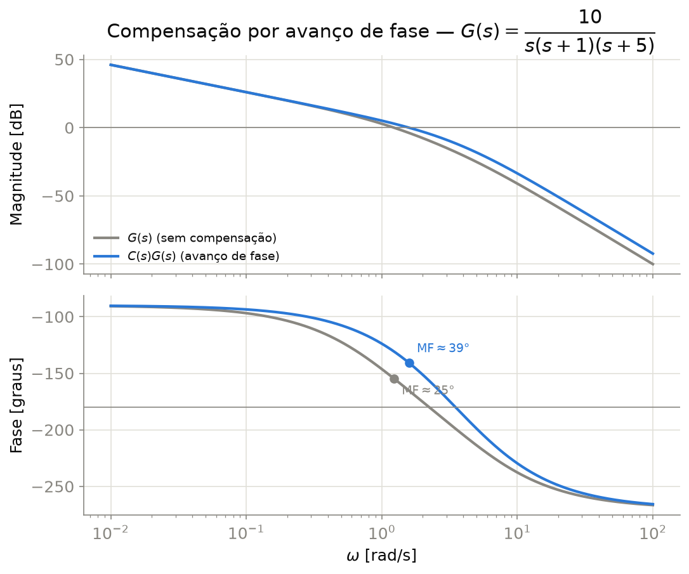
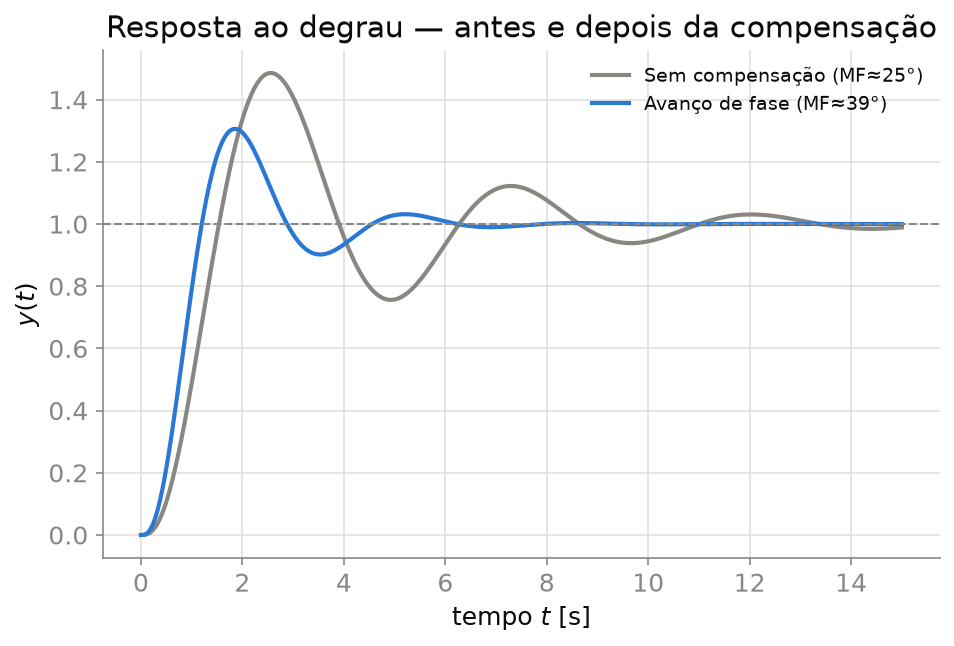

## Contexto

O projeto de compensadores no domínio da frequência trabalha diretamente com a margem de fase (MF), usando a relação aproximada $\zeta\approx\text{MF}/100$ (válida para MF $\lesssim 60°$) para traduzir uma especificação de sobressinal em uma meta de MF — a mesma ponte tempo↔frequência já apresentada em `ControleClassico/Notas/Aula08RespostaFrequencia.qmd`.

O compensador de **avanço de fase** é o análogo, no domínio da frequência, do zero do PD por LGR (nota anterior): ele adiciona fase positiva perto da frequência de cruzamento de ganho, aumentando a MF e, por consequência, reduzindo o sobressinal e melhorando o amortecimento — sem alterar o ganho de baixa frequência (erro de regime permanente).

Pré-requisito: diagrama de Bode, margens de ganho/fase (ver `Aula08RespostaFrequencia.qmd`).

::: {.callout-note}
Nesta nota, $\omega_{gc}$ denota a frequência de **cruzamento de ganho** ($|GH|=0$ dB, associada à MF) e $\omega_{pc}$ a de **cruzamento de fase** ($\angle GH=-180°$, associada à MG) — convenção padrão de livro-texto. Vale conferir: `Aula08RespostaFrequencia.qmd` usa os subscritos trocados (`ω_pc` para cruzamento de ganho e `ω_gc` para cruzamento de fase); os valores numéricos lá estão corretos, só a nomenclatura está invertida em relação ao padrão.
:::

## Formulação Matemática

Compensador de avanço: $C(s) = \dfrac{1+Ts}{1+\alpha T s}$, com $0<\alpha<1$ (contribui fase positiva máxima $\phi_{max}$ na frequência $\omega_m = \dfrac{1}{T\sqrt{\alpha}}$).

- **Fase máxima do avanço:** $\sin\phi_{max} = \dfrac{1-\alpha}{1+\alpha} \;\Rightarrow\; \alpha = \dfrac{1-\sin\phi_{max}}{1+\sin\phi_{max}}$
- **Fase necessária:** $\phi_{max} = \text{MF}_{desejada} - \text{MF}_{atual} + \epsilon$, com margem de segurança $\epsilon\approx5$–$12°$ (o avanço desloca $\omega_{gc}$ para uma frequência maior, então a MF real obtida costuma ficar um pouco abaixo do alvo ingênuo).
- **Nova frequência de projeto $\omega_m$:** escolhida onde $|G(j\omega)|_{dB} = -10\log_{10}(1/\alpha) = 10\log_{10}\alpha$ (ganho que o avanço "compensa" ao subir a curva de magnitude ali).
- **Constante de tempo:** $T = \dfrac{1}{\omega_m\sqrt{\alpha}}$.

## Projeto do Compensador — Exemplo

Planta de exemplo (mesma de `Aula08RespostaFrequencia.qmd`): $G(s) = \dfrac{10}{s(s+1)(s+5)}$, com MF atual $\approx 25°$ (em $\omega_{gc}\approx1{,}23$ rad/s) e MG $\approx 9{,}5$ dB.

Meta: elevar a MF para $\approx 45°$ (reduzindo o sobressinal esperado de $M_p\approx53\%$ para $M_p\approx25\%$, pela tabela de `Aula08RespostaFrequencia.qmd`).

- $\phi_{max} = 45° - 25° + 5° = 25°\ \Rightarrow\ \alpha \approx 0{,}412$
- $\omega_m \approx 1{,}585$ rad/s (onde $|G|_{dB}\approx-3{,}85$ dB)
- $T \approx 0{,}983$ s

$$C(s) = \frac{1+0{,}983\,s}{1+0{,}405\,s}$$

**Resultado real** (a MF obtida fica um pouco abaixo do alvo ingênuo, como esperado): MF $\approx 39°$, MG $\approx 11{,}5$ dB, em $\omega_{gc}\approx1{,}58$ rad/s. Ainda assim, uma melhora expressiva sobre a planta não compensada.

## Figuras

{#fig-bode-lead-comparacao}

{#fig-bode-lead-resposta}

Script gerador: `NotasRapidas/scripts/gerar_figuras.py` (funções `fig_bode_lead_comparacao` e `fig_bode_lead_resposta`).

## Referências

- OGATA, K. *Engenharia de Controle Moderno*. Pearson.
- FRANKLIN, G. F.; POWELL, J. D.; EMAMI-NAEINI, A. *Feedback Control of Dynamic Systems*. Pearson.
- **MIT OpenCourseWare** — [2.14 Analysis and Design of Feedback Control Systems](https://ocw.mit.edu/courses/2-14-analysis-and-design-of-feedback-control-systems-spring-2014/) (acesso aberto).
- Documentação do `python-control` (`margin`, `frequency_response`, acesso aberto): <https://python-control.readthedocs.io/>
